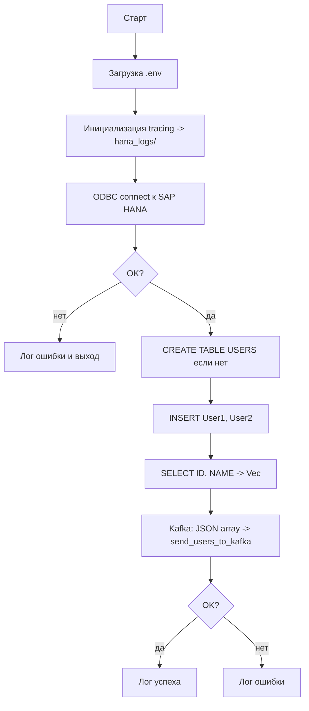

# from-hana-to-kafka

Утилита на **Rust**: подключается к **SAP HANA** по **ODBC**, гарантирует наличие таблицы `USERS`,
добавляет тестовые строки, читает данные в `Vec<UserRow>` и отправляет их в **Apache Kafka** одним
JSON‑сообщением.

Логи пишутся через `tracing` в каталог `hana_logs/` (неблокирующая запись). Префикс файлов: `rust-log-hana`.

## Что делает `main`

Реализовано в [`src/main.rs`](src/main.rs):

- Загружает `.env` (через [`env_work`](src/env_work.rs))
- Инициализирует логирование (через [`my_log`](src/my_log.rs))
- Подключается к SAP HANA через ODBC (`HANA_ODBC_CONNECTION`)
- Создаёт таблицу `USERS`, если её нет
- Вставляет 2 строки: `User1`, `User2`
- Читает строки: `SELECT ID, NAME FROM USERS ORDER BY ID` → `Vec<UserRow>`
- Отправляет `Vec<UserRow>` в Kafka топик из `.env` одним JSON‑сообщением (через [`kafka`](src/kafka.rs))

## Конфигурация (`.env`)

Файл `.env` лежит в корне проекта.

### Kafka

- `KAFKA_BROKERS`: например `localhost:9092`
- `KAFKA_TOPIC`: например `log_users`
- `KAFKA_TIMEOUT`: таймаут отправки сообщения, секунды
- `KAFKA_CONNECT_TIMEOUT`: таймаут установки соединения, секунды

### SAP HANA (ODBC)

- `HANA_ODBC_CONNECTION`: строка подключения ODBC без DSN, пример:

```text
HANA_ODBC_CONNECTION=Driver={HDBODBC};ServerNode=hana-host.example.com:30015;UID=MYUSER;PWD=MYPASSWORD;
```

## Схема таблицы `USERS`

Таблица создаётся, если отсутствует:

- `ID`: `BIGINT GENERATED BY DEFAULT AS IDENTITY`, `PRIMARY KEY`
- `NAME`: `NVARCHAR(255) NOT NULL`

Примечание: у SAP HANA нет отдельного «unsigned int»; используется `BIGINT`.

## Формат сообщения в Kafka

В Kafka отправляется **один** JSON‑массив объектов `UserRow` (см. `send_users_to_kafka` в [`src/kafka.rs`](src/kafka.rs)).

Пример:

```json
[
  { "id": 1, "name": "User1" },
  { "id": 2, "name": "User2" }
]
```

## Блок‑схема работы



## Запуск

Из корня проекта:

```bash
cargo run
```

Логи смотрите в `hana_logs/`.

## Документация API (rustdoc)

```bash
cargo doc --no-deps --open
```

Сгенерирует HTML по публичным элементам крейта (в основном в `src/main.rs` и подмодулях).

