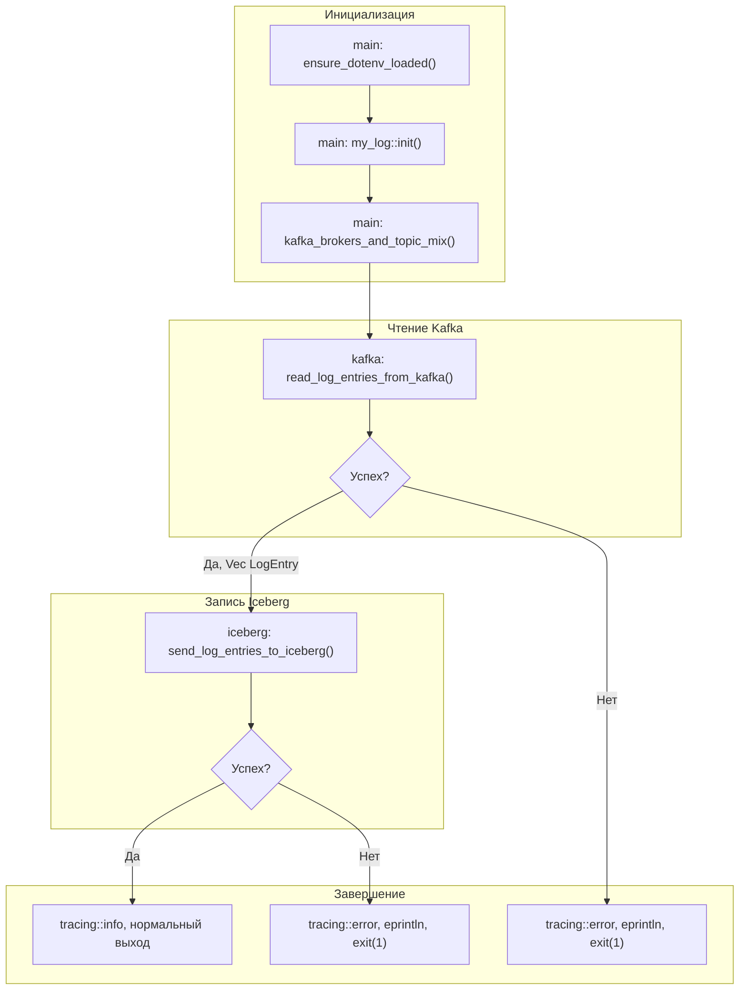
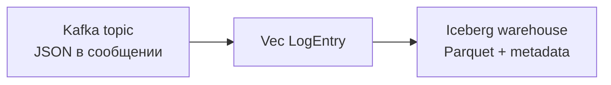

# from-kafka-to-iceberg

Консольное приложение на **Rust**: чтение сообщений из **Apache Kafka** (полезная нагрузка в **JSON** как один [`LogEntry`](src/main.rs) или массив таких записей), преобразование в `Vec<LogEntry>` и запись в таблицу **Apache Iceberg** (формат **Parquet**, каталог **in-memory** поверх локального **warehouse**).

Логи работы приложения пишутся в каталог `log_out/` через `tracing` (см. [`src/my_log.rs`](src/my_log.rs)).

## Требования

- **Rust** (рекомендуется актуальный stable; для зависимости `iceberg` 0.9 нужна совместимая версия компилятора, см. [iceberg на crates.io](https://crates.io/crates/iceberg)).
- Сборка **rdkafka** с `cmake-build`: установленный **CMake** и среда для сборки нативных библиотек (на Windows — типично MSVC).
- Доступный **Kafka** с топиком и сообщениями в ожидаемом JSON-формате.
- Локальный каталог для **Iceberg warehouse** (путь задаётся в `.env`).

## Конфигурация (`.env`)

| Переменная | Назначение |
|------------|------------|
| `KAFKA_BROKERS` | Список брокеров (bootstrap), например `localhost:9092` |
| `KAFKA_TOPIC` | Имя топика для чтения |
| `KAFKA_TIMEOUT` | Таймаут операций с Kafka, секунды (в т.ч. верхняя граница цикла чтения consumer) |
| `KAFKA_CONNECT_TIMEOUT` | Таймаут установки соединения с брокером, секунды |
| `ICEBERG_WAREHOUSE` | Корень warehouse на диске (абсолютный путь), например `C:/Data/iceberg-warehouse` |

Опционально: `RUST_LOG` для уровня логирования `tracing` (например `info`).

Пример см. в файле [`.env`](.env) в корне репозитория.

## Запуск

```text
cargo run
```

При ошибке чтения из Kafka или записи в Iceberg процесс завершается с кодом **1**; сообщение дублируется в stderr и в лог.

## Структура модулей

| Модуль | Файл | Роль |
|--------|------|------|
| `env_work` | [`src/env_work.rs`](src/env_work.rs) | Загрузка `.env`, статики `KAFKA_*`, `ICEBERG_WAREHOUSE` |
| `my_log` | [`src/my_log.rs`](src/my_log.rs) | Инициализация `tracing`, ротируемые файлы в `log_out/` |
| `kafka` | [`src/kafka.rs`](src/kafka.rs) | Consumer (`rdkafka`), разбор JSON → `Vec<LogEntry>` |
| `iceberg` | [`src/iceberg.rs`](src/iceberg.rs) | Запись батча в Iceberg (`iceberg` crate), таблица `logging.log_entries` |
| `main` | [`src/main.rs`](src/main.rs) | Точка входа, тип `LogEntry`, оркестрация конвейера |

## Подготовка данных для записи в Iceberg

Запись в Iceberg в текущей реализации идёт через **Arrow `RecordBatch`** и writer из крейта `iceberg`:

- **Источник данных**: `Vec<LogEntry>`, полученный из Kafka в `kafka::read_log_entries_from_kafka()` (см. [`src/kafka.rs`](src/kafka.rs)).
- **Схема таблицы Iceberg**: задаётся функцией `log_entry_iceberg_schema()` (см. [`src/iceberg.rs`](src/iceberg.rs)).
  - Поля фиксированы и идут в одном порядке: `timestamp`, `level`, `component`, `message`.
  - Field ID **1–4** фиксированы (после создания таблицы их нельзя менять без миграции).
  - Все поля обязательные (`required`) и имеют тип `string`.
- **Преобразование в Arrow**: в `iceberg::send_log_entries_to_iceberg()` формируются четыре `StringArray` и собираются в `RecordBatch`:
  - `timestamp`: `StringArray` из `LogEntry.timestamp`
  - `level`: `StringArray` из `LogEntry.level.to_string()` (в таблице уровень хранится как строка из одного символа)
  - `component`: `StringArray` из `LogEntry.component`
  - `message`: `StringArray` из `LogEntry.message`
- **Согласование схем**: `iceberg`-схема таблицы преобразуется в Arrow-схему через `schema_to_arrow_schema(...)` (это важно для корректных field id в Parquet).
- **Запись**: `RecordBatch` записывается в Parquet data file (writer chain Parquet → rolling → DataFileWriter), после чего список `DataFile` коммитится в таблицу через транзакцию `fast_append`.

Вся эта логика находится в [`src/iceberg.rs`](src/iceberg.rs) в функции `send_log_entries_to_iceberg()`.

## Блок-схема работы

Ниже — поток управления от старта до успешного завершения или выхода с ошибкой.



### Поток данных (упрощённо)



### Текстовая блок-схема (без Mermaid)

```text
+---------------------------+
| Загрузка .env             |
| Логи tracing              |
| Проверка KAFKA_* и        |
| ICEBERG_WAREHOUSE         |
+-------------+-------------+
              |
              v
+---------------------------+
| Consumer Kafka            |
| JSON -> Vec<LogEntry>     |
+-------------+-------------+
              | Ok
              v
+---------------------------+
| Iceberg: Parquet +        |
| fast append таблицы       |
+-------------+-------------+
              | Ok
              v
+---------------------------+
| Выход 0                   |
+---------------------------+

На любом Err: stderr + exit(1)
```

## Документация API (rustdoc)

По аналогии с проектом **rust-log-parser**: корневой **`//!`** в [`src/main.rs`](src/main.rs) описывает крейт и модули; публичные элементы доступны с главной страницы сгенерированной документации.

Из корня репозитория:

```bash
cargo doc --no-deps --open
```

Будет открыт HTML с описанием публичного API (в т.ч. реэкспортов `pub use` из `main.rs` и документации подмодулей `env_work`, `kafka`, `iceberg`, `my_log`).

## Зависимости (основные)

См. [`Cargo.toml`](Cargo.toml): `tokio`, `rdkafka`, `serde` / `serde_json`, `iceberg`, `arrow-array`, `parquet`, `tracing`, `dotenv`.

## Лицензия и заметки

Проект учебный/прикладной; при использовании в продакшене уточните политику consumer offsets в Kafka, идемпотентность записи и выбор реального Iceberg-каталога (REST/JDBC и т.д.) вместо демонстрационного `MemoryCatalog`.
