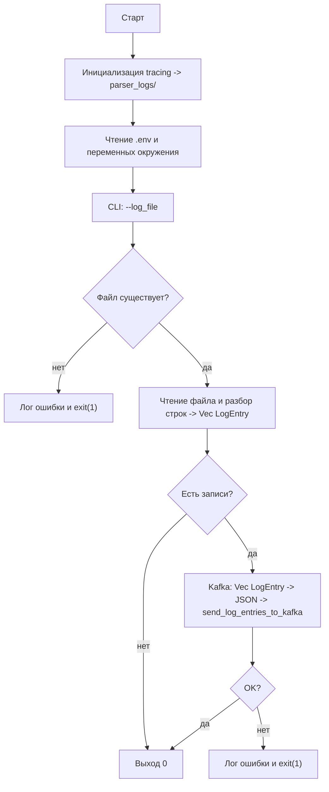

# rust-log-parser

Утилита на Rust для разбора текстовых лог-файлов в структуры [`LogEntry`](src/main.rs), опциональной отправки результатов в **Apache Kafka** (JSON) и записи служебных сообщений в файлы в каталоге `parser_logs/`.

## Возможности

- Разбор строк заданного формата (регулярное выражение в `parse_log_lines`).
- Загрузка настроек из `.env` и переменных окружения (`dotenv`).
- Отправка вектора записей в Kafka одним JSON-сообщением (`rdkafka`, асинхронный продюсер).
- Логирование через `tracing` с неблокирующей записью в `parser_logs/` (`tracing-appender`).

## Требования

- **Rust** (edition 2021, рекомендуется актуальный stable).
- Для сборки **`rdkafka`** с фичей `cmake-build`: **CMake** и среда сборки C++ (на Windows — MSVC из Visual Studio).
- Для отправки в Kafka — доступный брокер, совместимый с клиентом librdkafka.

## Конфигурация

Создайте файл **`.env`** в корне проекта (рядом с `Cargo.toml`). Пример:

| Переменная | Назначение |
|------------|------------|
| `KAFKA_BROKERS` | Список брокеров, например `localhost:9092` |
| `KAFKA_TOPIC` | Имя топика |
| `KAFKA_TIMEOUT` | Таймаут операции отправки сообщения (секунды) |
| `KAFKA_CONNECT_TIMEOUT` | Таймаут установки соединения с брокером (секунды; в клиент передаётся как `socket.connection.setup.timeout.ms`) |

Уровень логов можно задать через **`RUST_LOG`** (например, `RUST_LOG=info`, `RUST_LOG=debug`).

## Сборка и запуск

Из корня проекта:

```bash
cargo build --release
cargo run --release -- --log_file путь/к/файлу.log
```

Пример с логом в репозитории:

```bash
cargo run -- --log_file hana_logs/indexserver.trc
```

Формат строк в логе должен соответствовать шаблону в `parse_log_lines` (префикс `[…]{…}[…]`, дата/время, уровень, компонент, файл и строка, сообщение). Для произвольных логов SAP HANA шаблон может потребовать доработки.

## Каталоги

| Каталог | Назначение |
|---------|------------|
| `parser_logs/` | Ротируемые файлы логов работы программы (`tracing-appender`, префикс имени задаётся в `my_log`). |
| `hana_logs/` | Пример размещения логов СУБД (например, `indexserver.trc`); путь передаётся через `--log_file`. |

## Блок-схема работы программы



### Поток данных (упрощённо)


## Тесты

```bash
cargo test
```

Интеграционный тест отправки в Kafka помечен `#[ignore]` — запуск при поднятом брокере:

```bash
cargo test sends_parsed_line_to_kafka -- --ignored
```

## Структура модулей

| Модуль | Роль |
|--------|------|
| `env_work` | Загрузка `.env`, статические значения `KAFKA_BROKERS`, `KAFKA_TOPIC`. |
| `kafka` | Таймауты, `kafka_brokers_and_topic_mix`, `send_log_entries_to_kafka`. |
| `my_log` | Инициализация `tracing` и неблокирующая запись в `parser_logs/`. |

## Документация API (rustdoc)

```bash
cargo doc --no-deps --open
```

Сгенерирует HTML по публичным элементам крейта (в основном в `main.rs` и подмодулях).
